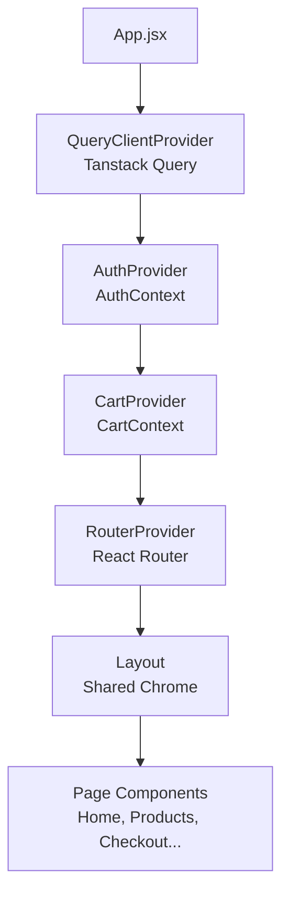
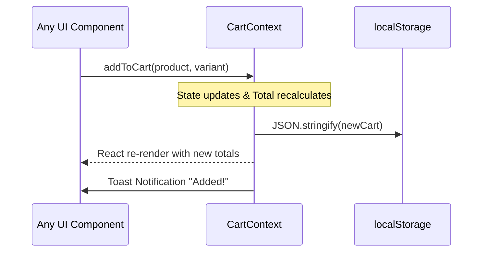

# Shree's Namkeen: Frontend Architecture & Documentation

This document provides a single-glance overview of the frontend architecture, state management, routing, and component strategy for the Shree's Namkeen e-commerce platform.

---

## 🏗️ 1. High-Level Architecture

The application is a **React Single Page Application (SPA)** built with Vite, utilizing a highly modular and context-driven architecture.



### Core Technologies
| Layer | Technology | Purpose |
| :--- | :--- | :--- |
| **Build Tool** | Vite | Lightning-fast HMR and optimized production builds. |
| **Routing** | React Router v6 | `createBrowserRouter` for programmatic, data-driven routing. |
| **Global State** | React Context API | Lightweight global state for Cart, Wishlist, and Auth. |
| **Caching/Fetch** | React Query v5 | Pre-configured caching (5m stale time) ready for Phase 3 APIs. |
| **Styling** | Tailwind CSS v4 | Utility-first styling combined with custom variables in `index.css`. |
| **PWA Base** | `vite-plugin-pwa` | Offline capabilities, asset caching (Pexels CDN), installable app manifest. |

---

## 🗺️ 2. Routing Topography

All routes are nested inside a shared `<Layout />` shell ensuring persistent navigation (Header, Footer, CartSidebar).

| Route Path | Component rendered | Description / Behavior |
| :--- | :--- | :--- |
| `/` | `<Home />` | Landing page, hero, categories grid, bestsellers. |
| `/products` | `<Products />` | Dynamic catalog. Reads `?category=` & `?q=` URL params to filter. |
| `/products/:id` | `<ProductDetail />` | Individual product view. Extracts `:id` via `useParams()`. |
| `/login` | `<LoginPage />` | Mock authentication entry. Validates and pushes to Home. |
| `/register`| `<RegisterPage />` | Mock registration. Client-side form validation. |
| `/checkout`| `<CheckoutPage />` | Delivery form (pre-fills City), Payment selection, robust order summary. |
| `*` (Catch-all)| 404 Fallback | Graceful error boundary for unknown links. |

---

## 🧠 3. State Management

The app completely avoids "prop-drilling" by utilizing heavily encapsulated Context Providers.

### A. CartContext (`src/context/CartContext.jsx`)
Acts as the global brain for shopping mechanics. It abstracts away `localStorage` persistence.

**Exposed State/Methods:**
- `cart` (Array of items) & computed totals (`cartTotal`, `cartCount`, `shippingCost`, `finalTotal`)
- `wishlist` (Array of Product IDs)
- Mutations: `addToCart()`, `removeFromCart()`, `updateQuantity(id, absoluteQty)`, `clearCart()`, `toggleWishlist()`
- Notifications: `showNotificationMessage(msg)` via React-Hot-Toast / custom Toast.

### B. AuthContext (`src/context/AuthContext.jsx`)
Manages the user session. Currently stores mock tokens in `localStorage`.

**Exposed State/Methods:**
- `user` (Object or null), `isAuthenticated` (Boolean), `loading` (Boolean)
- Mutations: `login(email, password)`, `register(userData)`, `logout()`



---

## 🧩 4. Component Structure

The `src/` directory is strictly divided into logical domains to separate business logic from UI rendering.

```text
src/
├── components/           # ♻️ Reusable UI blocks
│   ├── layout/Layout.jsx # The Application Shell
│   ├── Header.jsx        # Sticky nav, Search with 500ms debounce
│   ├── Footer.jsx        # Static links
│   ├── CartSidebar.jsx   # Slide-out drawer consuming CartContext
│   └── ProductCard.jsx   # Grid card consuming Cart/Wishlist context
├── context/              # 🧠 State providers
│   ├── AuthContext.jsx
│   └── CartContext.jsx
├── data/                 # 💾 Static Catalogs / Mock Data
│   └── products.js       
├── pages/                # 📄 View-level route components
│   ├── Home.jsx
│   ├── Products.jsx
│   ├── ProductDetail.jsx
│   ├── CheckoutPage.jsx
│   ├── LoginPage.jsx
│   └── RegisterPage.jsx
├── routes.jsx            # 🚦 Router Configuration
├── App.jsx               # 🔌 Provider Composer layer
└── index.css             # 🎨 Global Tailwind imports & keyframes
```

### Component Design Principles Used
1. **Dumb Components are Smart Context Consumers:** Components like `ProductCard` and `CartSidebar` do not receive props from parents (except basic IDs). They natively hook into Context for their data.
2. **URL-Driven State:** The search bar inside `<Header />` doesn't pass props to `<Products />`. It uses a 500ms debounce and updates the URL (`?q=searchTerm`). `<Products />` reacts to the URL change.

---

## 🎨 5. Styling & Assets

- **Fonts:** Employs 'Playfair Display' for premium headings, 'Montserrat' for clean body typography.
- **Micro-interactions:** Extensive use of Tailwind's `group-hover`, `scale`, and `transition-all` to make product cards and buttons feel dynamic.
- **Alerts:** Replaced rudimentary custom alerts with **`react-hot-toast`**, offering polished, non-blocking toast notifications.

---

## 🚀 6. Phase 3 Migration Strategy (Backend Integration)

The frontend is architected to make dropping in an actual API backend seamless:

1. **Auth Integration:** In `AuthContext.jsx`, replace local mock assignment with `axios.post('/api/login')` and store the resulting JWT.
2. **Cart Syncing:** Instead of syncing to `localStorage` in `CartContext`, fire an async `PUT /api/cart` payload leveraging `react-query` mutations.
3. **Checkout/Orders:** In `CheckoutPage.jsx`, swap the `setTimeout` mock with an API request to generate a Razorpay order ID and invoke the Razorpay client script.
